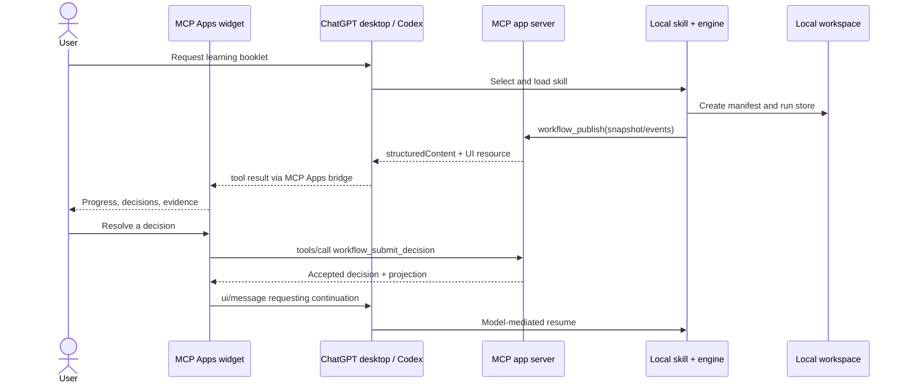

# Runtime and MCP Apps integration

## Supported surface

The installable unit is a Codex plugin containing a skill, an MCP-backed app, or both. The MVP combines both and targets Codex mode in the native ChatGPT desktop application on macOS. The custom component is still web content rendered by the host in a sandboxed iframe; it is not an AppKit extension and cannot replace native application chrome.

Official platform references:

- [Plugin availability and composition](https://learn.chatgpt.com/docs/plugins#overview)
- [Plugin structure](https://learn.chatgpt.com/docs/build-plugins#plugin-structure)
- [MCP-backed developer-mode plugin wiring](https://learn.chatgpt.com/docs/build-plugins#create-and-test-a-plugin-locally-that-points-to-an-mcp-server-backed-dev-mode-app)
- [Apps SDK quickstart](https://developers.openai.com/apps-sdk/quickstart#introduction)
- [MCP Apps compatibility](https://developers.openai.com/apps-sdk/mcp-apps-in-chatgpt#recommended-approach)

## Runtime boundary

The widget MUST NOT call the skill, a skill script, local shell, or filesystem directly. The documented widget bridge can call app-visible MCP tools, post a follow-up message, and update model-visible context; skill invocation remains a Codex host decision. See [MCP Apps UI bridge](https://developers.openai.com/apps-sdk/reference#mcp-apps-ui-bridge) and [skill activation](https://learn.chatgpt.com/docs/build-skills#how-codex-uses-skills).

## MCP tool surface

| Tool | Visibility | Side effect | Contract |
|---|---|---|---|
| `workflow_create` | model, app | Creates a projection record only; does not start a skill | Idempotent by `commandId`; returns `runId`, server-generated `createdAt`, revision, and launch message |
| `workflow_publish` | model | Reconciles an identical current snapshot or advances an existing projection with one typed engine command | Raw snapshots cannot advance state; rejects unknown runs, identity or permission changes, rewritten event prefixes, protocol/version mismatch, gaps, stale revision, and oversize payload |
| `workflow_get` | model, app | Read-only | Returns current sanitized snapshot and event cursor |
| `workflow_events` | app | Read-only | Returns events after `afterSeq`; bounded page size; no standard SSE reconnect claim |
| `workflow_submit_decision` | app | Records a user decision in projection | Idempotent; validates decision against the open interrupt |
| `workflow_render` | model | Attaches the widget resource | Returns useful model-readable text plus structured content |
| `workflow_cancel_request` | app | Records cancellation intent only | UI MUST also send a follow-up message; does not kill local execution directly |

Tool descriptions and annotations MUST state their actual behavior. Write tools MUST declare accurate `readOnlyHint`, `destructiveHint`, `openWorldHint`, and idempotency semantics; server authorization remains mandatory regardless of hints. [Tool descriptors and annotations](https://developers.openai.com/apps-sdk/reference#tool-descriptor-parameters).

## UI resource contract

- The component resource MUST use `text/html;profile=mcp-app` and a versioned `ui://` URI.
- Render tools MUST set `_meta.ui.resourceUri`; the OpenAI compatibility alias may be present but is not the primary key.
- App-callable tools MUST declare `_meta.ui.visibility` including `app`.
- HTML, CSS, and JavaScript MUST be bundled deterministically; breaking UI updates MUST use a new resource URI.
- `_meta.ui.csp` MUST enumerate the smallest exact connect/resource/frame domains. Subframes are prohibited in MVP.
- `_meta.ui.domain` MUST be unique and ready for submission.
- Tool results MUST provide `structuredContent` matching a declared output schema and concise model-readable `content`.

See [component template registration and CSP](https://developers.openai.com/apps-sdk/build/mcp-server#step-1--register-a-component-template).

## UI placement and lifecycle

The MVP supports the host-provided inline component and may request fullscreen for evidence inspection. Modal presentation is allowed only for a focused decision. PiP is not required. There is no supported persistent plugin sidebar or native desktop window.

Each rendered widget is message-scoped. Durable run truth therefore cannot live in React state or widget storage. The widget restores from `workflow_get`, uses local state only for ephemeral view preferences, and reconciles after every command. [Widget state lifecycle](https://developers.openai.com/apps-sdk/build/state-management#how-ui-components-live-inside-chatgpt).

## Local development

1. Run contract and tool-handler tests locally.
2. Build the component and start the MCP server.
3. Inspect tools and widget rendering with MCP Inspector.
4. Expose `/mcp` over HTTPS with Secure MCP Tunnel, ngrok, or equivalent.
5. Enable developer mode and create an app from that HTTPS endpoint.
6. Generate `.app.json` from the resulting `plugin_asdk_app...` ID and point `plugin.json.apps` to it.
7. Add the plugin to a repo or personal marketplace, restart ChatGPT desktop, install it, and start a fresh task.
8. After server/tool changes, rebuild, restart, and refresh developer-mode metadata. After plugin changes, update the marketplace source and restart the desktop app.

Sources: [Run locally](https://developers.openai.com/apps-sdk/quickstart#run-locally), [connect from ChatGPT](https://developers.openai.com/apps-sdk/deploy/connect-chatgpt#create-a-developer-mode-app), [local plugin install](https://learn.chatgpt.com/docs/build-plugins#install-a-local-plugin-manually), and [test your integration](https://developers.openai.com/apps-sdk/deploy/testing).

## Production boundary

Production needs a stable, low-latency HTTPS `/mcp` endpoint, dependable TLS, and operational logs. The workflow UI is therefore not offline-capable, even though the generated `index.html` artifact MUST be self-contained and offline-capable. [Deployment requirements](https://developers.openai.com/apps-sdk/deploy#deployment-options).

Public distribution submits the production MCP endpoint and plugin review materials rather than an existing developer-mode app ID. [Submit the MCP server](https://learn.chatgpt.com/docs/submit-plugins#submit-the-mcp-server-not-an-existing-app-reference).
