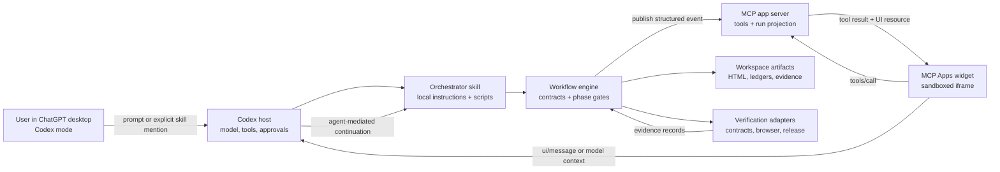

# System architecture

## Purpose

Learning Booklet Studio coordinates a long-running, evidence-driven learning-app workflow without granting a web widget privileged access to the local Codex runtime. It separates reasoning, deterministic workflow control, app presentation, and evidence so each can be tested independently.

## Context



## Components and contracts

| Component | Owns | Must not own | Primary contract |
|---|---|---|---|
| Codex host | Model turn, tool selection, approvals, sandbox enforcement | Product run truth | Installed plugin surfaces and host permissions |
| Orchestrator skill | Workflow routing, phase instructions, remediation decisions, user clarification policy | UI rendering, durable widget state | `SKILL.md` plus phase references |
| Workflow engine | Run state machine, commands, idempotency, phase gates, evidence validation | Domain research judgment | `codex-skill-ui/1`, workflow manifest, evidence manifest |
| MCP app server | MCP tools, event projection, widget resource, authorization | Direct local skill or shell execution | MCP tool schemas and Apps UI resource |
| Widget | Human-readable progress, decisions, evidence inspection, accessible controls | Authoritative state, filesystem, shell, direct skill invocation | MCP Apps bridge plus `codex-skill-ui/1` projection |
| Workspace artifact store | Generated booklet, plan, ledgers, reports, evidence files | UI session state | Paths and SHA-256 digests registered in evidence records |
| Verification adapters | Executed test results and native-desktop evidence | Self-asserted completion | Evidence records with producer and artifact digest |

## Required deployment shape

```text
plugin root/
  .codex-plugin/plugin.json
  .app.json                    # app mapping when generated for local testing
  .mcp.json                    # optional additional MCP configuration
  skills/
    build-learning-booklet/
      SKILL.md
      agents/openai.yaml
      references/
      scripts/
      assets/index.template.html
  packages/
    workflow-engine/           # authoritative state, gates, provenance
    mcp-server/                # MCP tools, projection, UI resource
    widget/                    # sandboxed iframe source and build output

workspace at runtime/
  .learning-booklet/
    runs/<run-id>/
      manifest.json
      events.ndjson
      evidence.json
      defects.json
  outputs/<project>/index.html
```

The app mapping, MCP deployment, and local marketplace packaging are separate concerns. Public plugin submission supplies the production MCP endpoint and review materials; it does not publish an existing developer-mode app reference.

## Control flow

1. The user invokes the plugin or asks for a matching learning-booklet task.
2. Codex loads the orchestrator skill through normal explicit or implicit skill selection.
3. The skill normalizes input into a versioned workflow manifest.
4. The engine creates a run, emits `RUN_STARTED`, and advances only through legal transitions.
5. Intake/design layer I0 resolves the authoritative manifest; phases P0–P10 then write declared artifacts, execute local verification, and emit evidence.
6. The phase gate passes only when required evidence is present and valid for the current artifact digests.
7. The skill publishes progress to the app through MCP tools. The widget renders a projection; it is never the source of truth.
8. Widget decisions call app-visible MCP tools. A request that needs Codex or local execution returns to the host through a follow-up message and is resolved by the agent.
9. Any failed downstream test reopens the earliest responsible phase, invalidates affected evidence, and triggers regression tests.
10. Release completes only after all production-required hard gates pass, including the native Intel journey against the exact candidate digest. Non-translated Apple Silicon status is retained as a separate non-blocking compatibility advisory.

## Reliability invariants

- Run commands MUST be idempotent by `commandId`.
- Events MUST be append-only and strictly ordered per `runId`.
- Every projection MUST be reproducible by replaying accepted events.
- A material artifact change MUST invalidate evidence tied to its previous digest.
- A phase MUST NOT be marked passed by prose, model confidence, or UI state alone.
- The widget MUST tolerate duplicate delivery, missing optional fields, reconnection, and stale cursors.
- Local files and secrets MUST NOT be sent to an app backend unless the user-authorized tool contract explicitly requires them.

## Portability boundaries

The plugin and skill are portable Codex assets. The widget is portable web content using the MCP Apps bridge. “Native macOS” describes the verified host environment, not a native AppKit extension API. Architecture-specific dependencies are prohibited unless their need is documented. Intel behavior is production-verified; Apple Silicon behavior remains separately reportable as a non-blocking compatibility advisory.

The `packages/workflow-engine` contract is shared by skill scripts and the MCP projection path. The engine is authoritative; `packages/mcp-server` may publish only a sanitized projection; `packages/widget` may hold only disposable view state. Removing both app packages MUST still leave a usable skill-only workflow.
