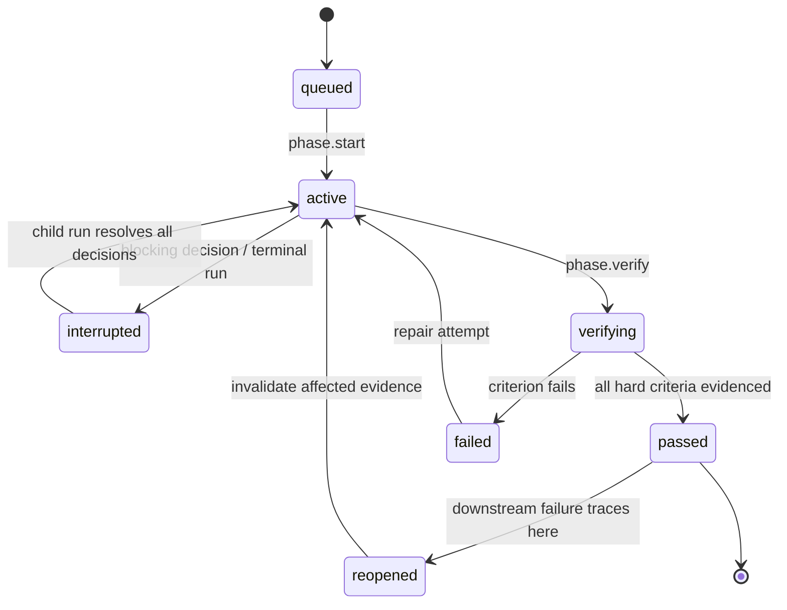

# Workflow-to-skill mapping

## Rule

The helper intake/design process maps to I0, and each original workflow phase maps one-to-one to P0–P10. Every layer has one normative instruction, engine phase ID, declared deliverable group, and gate contract. Shared scripts may support several phases, but no phase may disappear into an undifferentiated “generate app” step.

## Required skill layout

```text
skills/build-learning-booklet/
  SKILL.md
  agents/openai.yaml
  references/
    workflow-contract.md
    intent-and-design.md
    phase-00-charter.md
    phase-01-research.md
    phase-02-learning-architecture.md
    phase-03-information-architecture.md
    phase-04-interactions.md
    phase-05-visual-system.md
    phase-06-technical-plan.md
    phase-07-production.md
    phase-08-integration-validation.md
    phase-09-adversarial-review.md
    phase-10-release.md
  scripts/
    workflow-state.mjs
    compile-manifest.mjs
    validate-artifact.mjs
    audit-html.mjs
    audit-browser.mjs
    verify-release.mjs
  assets/
    index.template.html
```

`SKILL.md` is the only public skill and acts as a lean router and operating contract. Detailed phase instructions live under `references/`; deterministic state, validation, audit, and release work lives under `scripts/`. The model MUST NOT reproduce script logic from memory when the script is available.

## One-to-one mapping

| Source stage | Engine ID | Normative instruction | Deliverables | Gate and remediation |
|---:|---|---|---|---|
| Helper intake/design | `I0` | `intent-and-design.md` | Authoritative intent manifest, conflict resolution, exactly three design options when required, final design selection | All critical fields authoritative; user values locked; one coherent selection resolved or validly delegated |
| Phase 0 | `P0` | `phase-00-charter.md` | Charter, scope/non-scope, assumption ledger, risks, acceptance criteria | Reject contradictory artifact requirements; request only blocking decisions |
| Phase 1 | `P1` | `phase-01-research.md` | Source ledger, claim ledger, terminology, conflicts, empirical context | Central claims require credible support; unsupported claims are qualified, removed, or researched again |
| Phase 2 | `P2` | `phase-02-learning-architecture.md` | Objectives, prerequisites, misconception model, dependency map, assessment plan | Every objective maps to instruction, practice, assessment, and verification |
| Phase 3 | `P3` | `phase-03-information-architecture.md` | Section outline, linear/nonlinear journey, density and reference plans | All central concepts have an instructional home and coherent heading order |
| Phase 4 | `P4` | `phase-04-interactions.md` | Interaction inventory, state/keyboard/error behavior, tests | Every interaction has objective value, defined states, reset, keyboard path, and edge cases |
| Phase 5 | `P5` | `phase-05-visual-system.md` | Operationalized selected design system, layout map, tokens, components, responsive/print/accessibility rules | I0 selection is preserved; conflicts are resolved without regenerating options unless the user requests revision |
| Phase 6 | `P6` | `phase-06-technical-plan.md` | One-file app architecture, state/event/data structures, construction sequence | No hidden runtime dependency; initialization and keyboard paths are deterministic |
| Phase 7 | `P7` | `phase-07-production.md` | Complete content, diagrams, interactions, assessments, citations | No placeholders/dead controls; examples, diagrams, answers, and feedback agree |
| Phase 8 | `P8` | `phase-08-integration-validation.md` | Integrated `index.html`, regression results, portability/privacy report | All critical tests pass or are honestly `not_run`; failures reopen responsible phase |
| Phase 9 | `P9` | `phase-09-adversarial-review.md` | Findings by severity, repairs, affected regression reruns | All blocker and major findings repaired and retested |
| Phase 10 | `P10` | `phase-10-release.md` | Release decision report, verification matrix, residual risks, maintenance notes | Every production-required hard gate, including native Intel evidence, passes; Apple Silicon status remains an advisory |

## Script contracts

| Script | Input | Output | Failure behavior |
|---|---|---|---|
| `workflow-state.mjs` | Versioned command and current run store | Accepted event(s) and materialized run projection | Rejects invalid transition, duplicate conflict, sequence gap, or unsupported protocol |
| `compile-manifest.mjs` | Intent-manifest JSON containing authoritative values, locks, choices, defaults, and resolved conflicts | Pasteable `intent.manifest.txt` variable manifest, written to stdout or `--output` | Exits non-zero for missing required values, unresolved placeholders/critical conflicts, invalid mode, or non-authoritative visual direction; never invents a missing critical choice |
| `validate-artifact.mjs` | A JSON artifact and its JSON Schema | AJV-backed structural validation report, written to stdout and optionally `--report` | Returns `fail` for schema mismatch and `not_run` when JSON or a validator cannot be loaded; it does not inspect HTML |
| `audit-html.mjs` | Generated `index.html` | Deterministic semantic, link, script, privacy, and offline-static evidence | Marks unavailable dynamic checks `not_run`; never promotes them to pass |
| `audit-browser.mjs` | Artifact plus browser profile | Executed interaction, console, network, viewport, and accessibility evidence | Preserves output and exit code; failure reopens earliest responsible phase |
| `verify-release.mjs` | A run root or `run-state.json` | Engine-derived release-decision report, written to stdout and optionally `--report` | Loads canonical state, applies `release.decide` through the workflow engine, validates the event log, and exits non-zero unless the authoritative decision passes |

`workflow-state.mjs apply` accepts the versioned engine command envelope and writes under `.learning-booklet/runs/<run-id>/`. `validate-artifact.mjs` is the generic JSON-contract validator; HTML portability and runtime behavior belong to `audit-html.mjs` and `audit-browser.mjs`. `verify-release.mjs` is the run-state decision wrapper; it MUST delegate the authoritative gate calculation through command `release.decide` to the engine's `releaseDecision` logic rather than reimplementing the decision in shell/model logic. Repository policy, secrets, licensing, archive creation, and checksums are separate distribution-verification responsibilities outside this skill-local wrapper.

## Phase protocol

Every phase follows the same engine-visible loop:



The engine records each phase attempt as an immutable terminal snapshot containing
its artifact IDs, evidence IDs, gate-result snapshots, timestamps, outcome, and
failure. A retry increments the phase attempt number; causal `phase.reopen`
records the failed phase, earliest responsible phase, failure code, stale evidence,
and reopening reason without rewriting the prior attempt.

`interrupted` is a phase-projection state across runs, not a paused live run. The producing run ends with `RUN_FINISHED(outcome=interrupt)`; the transition back to `active` occurs only in a new child run on the same task/thread with a complete `resume[]` set. Normal dependency order is `I0 → P0 → P1 → … → P10`.

## Deterministic native remediation path

`packages/workflow-engine/native-fixture-cli.mjs` is a packaged release fixture,
not test-only code. It creates a design interrupt and child resume, then injects
`NATIVE_FIXTURE_FOCUS_OBSCURED` at P8. The failure records the P7 attempt-1
production artifact ID and digest as its root cause. The repair command causally
reopens P7, preserves the failed P8 attempt/evidence, creates a different P7
attempt-2 artifact, and executes fresh P8, P9, and P10 evidence before release.
The required Intel journey and any advisory Apple Silicon journey run this same
fixture from the installed candidate and retain its JSON report. The report's `transport.parentEvents` and
`transport.childEvents` are the actual deterministic `codex-skill-ui/1`
sequences: the parent ends in `interrupt`, the child starts at `seq: 0` with the
complete `resume[]`, and the repaired child ends in `success` after P10.

## GPT-5.6 Sol tuning boundary

The workflow is tested with GPT-5.6 Sol as its flagship reasoning baseline, but the plugin MUST NOT claim to pin or enforce the host model. Model-sensitive tuning belongs in concise phase instructions, tool descriptions, representative eval cases, and recorded test metadata. Correctness MUST come from contracts and gates rather than model-name assumptions.
